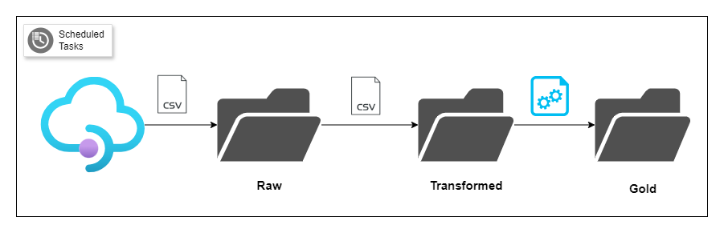
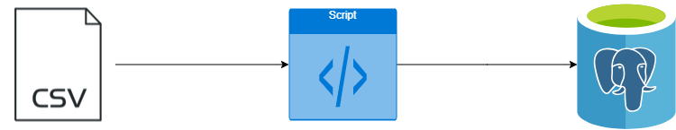

# CoreDataEngineers ETL Pipeline and Data Analysis

## Overview
This repository contains Bash scripts and SQL queries designed to manage a simple ETL pipeline and perform data analysis on competitor data from Parch and Posey. The project includes extracting, transforming automating these processes with cron jobs, loading CSV data in the PostgreSQL database using bash scripting, and performing SQL queries to derive insights from a PostgreSQL database. It also contains a script that moves CSV and JSON file formats.

### Bash Script for ETL Pipeline

#### Extract
The Bash script downloads a CSV file from a given URL (defined as an environment variable) and saves it into a raw folder.
The script confirms that the file was downloaded successfully before proceeding to the next step.

#### Transform
The script renames the column Variable_code to variable_code and selects only the following columns: year, Value, Units, and variable_code.
The transformed data is saved into a file named 2023_year_finance.csv in the Transformed folder.

#### Load
The transformed file is moved into a Gold folder, and the script confirms that it was successfully loaded.

### Moving CSV and JSON Files
A separate Bash script moves all CSV and JSON files from a specified source folder to json_and_csv. This script handles one or more files simultaneously and confirms successful movement.

### Importing CSV Files into PostgreSQL
The Bash script import_csv_to_postgres.sh is used to import multiple CSV files into a PostgreSQL database named Posey. It loops through all the CSV files in a directory and copies them into the specified PostgreSQL table using the \copy command.
